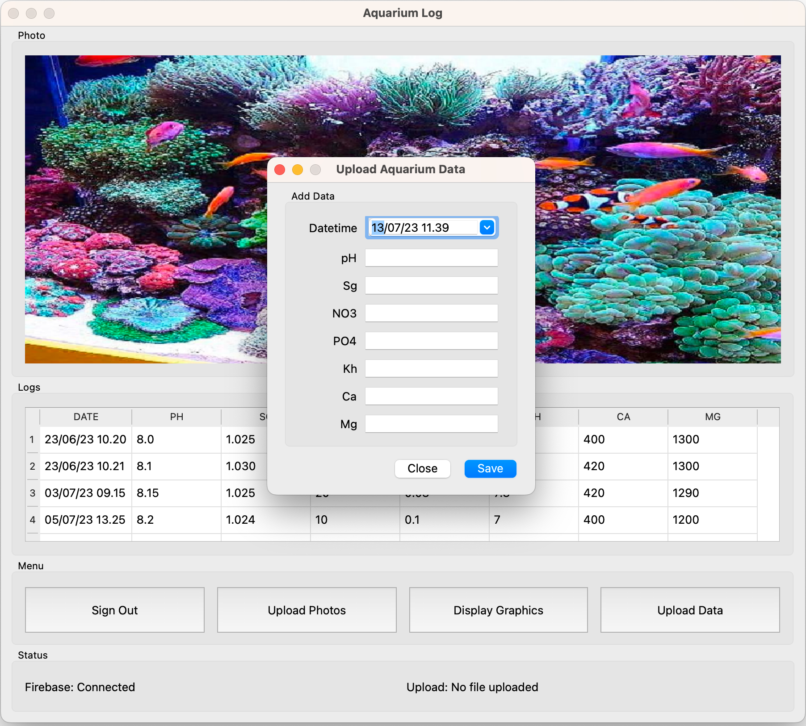
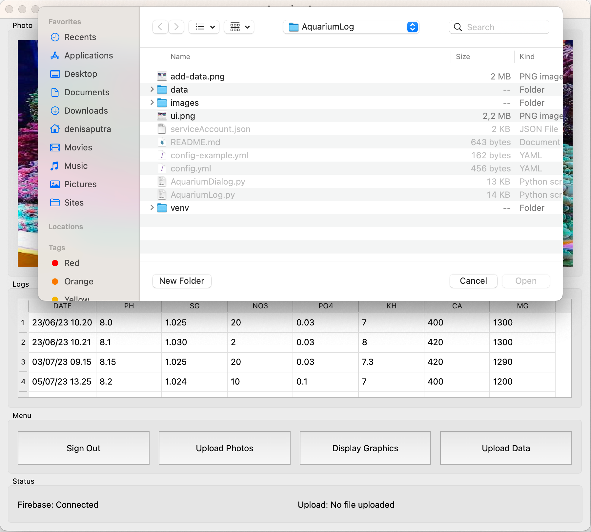
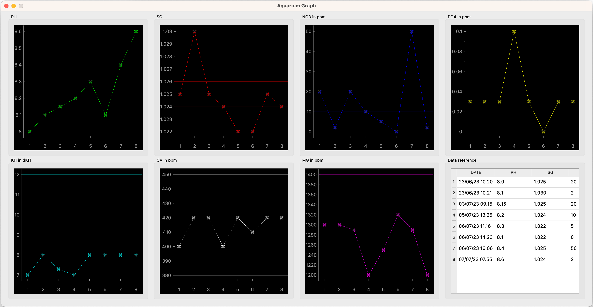

# About AquariumLog
Python app based on PyQT6. The app will log and store aquarium data in firebase

# Features
- Upload multiple aquarium photo image
- Store aquarium data
- Generate and display graphics for each aquarium water parameters
- Offline enable (data and images synced in local, no need to login to view data)
- Graph display recommended range

# UI Mockup

# UI Add data

# UI Upload image

# UI Graph display

# Requirements
- pyrebase4
- pyqt6
- pyaml
- pyqtgraph

# Firebase Setup
- Enable email Sign-in method : Email/Password
- Setup Firestore Databse
- configure config.yml (see config-example.yml)

