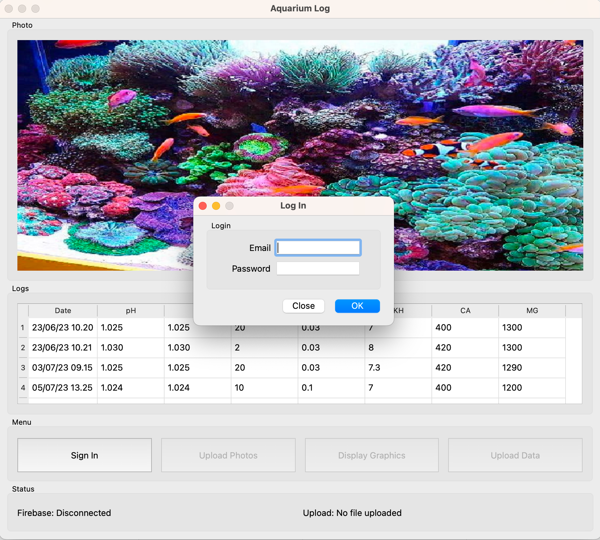

# About AquariumLog
Python app based on PyQT6. The app will log and store aquarium data in firebase

# Features
- Upload aquarium photo image
- Store aquarium data
- Generate and display graphics for each aquarium water parameters

# UI Mockup

# Requirements
- pyrebase4
- pyqt6
- pyaml

# Firebase Setup
- Enable email Sign-in method : Email/Password
- Setup Firestore Databse
- configure config.yml (see config-example.yml)

