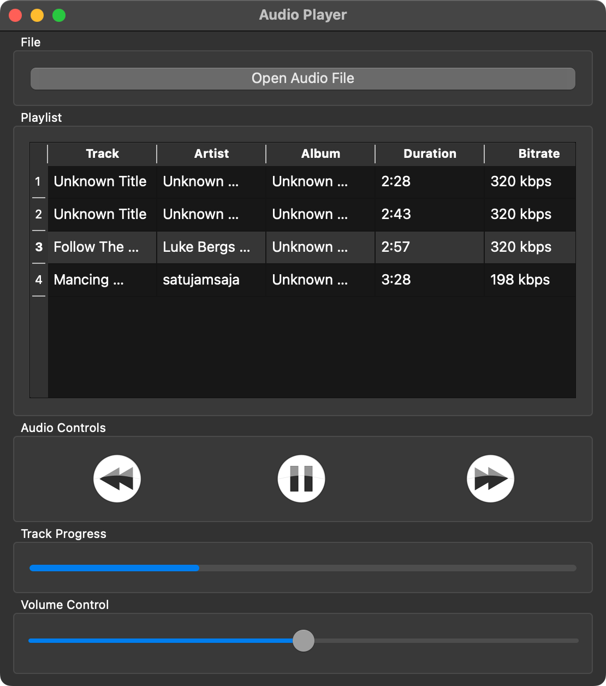

# About Audiaplayer
Python app based on PyQT6. This app is audio player support mp3 format at this time

# Features
- Select multiple mp3 files
- Loop play
- Spectrum visualizer

# UI 

# Requirements
- pyqt6
- pygame
- mutagen
- pydub
- numpy

