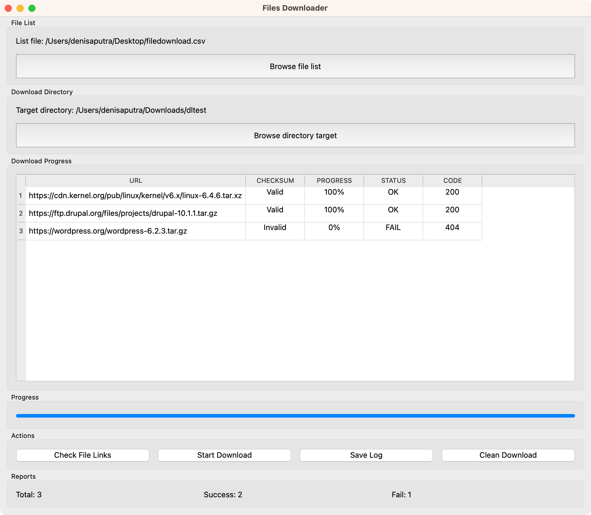

# About Files Download
Python app based on PyQT6. This app will download files based on the files list in csv/json format

# Features
* Concurrent download (Upcoming feature)
* Download any files over http 
* Select file list download in csv format
* Reports (success or failed), can be exported as csv
* Select directory target for download
* Progress bar download progress, check links and file deletion
* File integrity check with md5 hash

# UI

# Demo
Demo [Video Demo](https://www.youtube.com/watch?v=DV2SD20nhZI)

# Requirements
* pyqt6
* requests
* 

